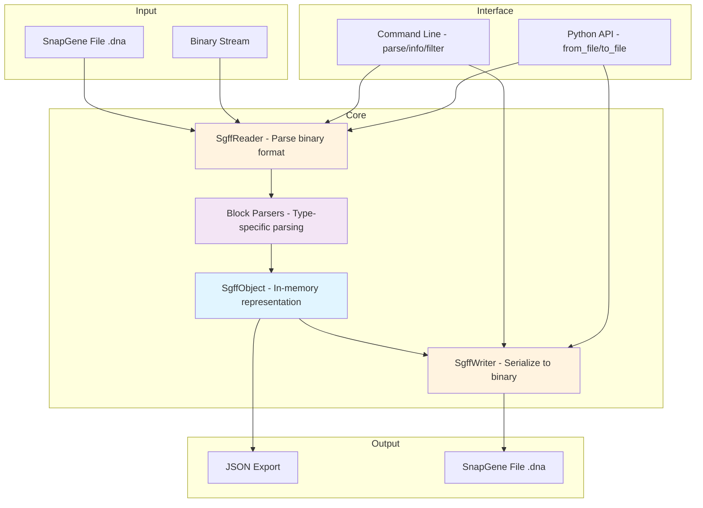

# SnapGene File Format Converter

This is a reversed engineered parser for SnapGene file formats (SGFF in short) - for dna, rna and protein.

Currently parser partially do it's job, the result is a JSON dictionary, and also a minimalistic writer.

Ideally this project will create a set of writer and reader classes with the following scheme:




## File Format Overview

SnapGene files use a **Type-Length-Value (TLV)** binary format. Each block consists of:
- 1 byte: block type ID
- 4 bytes: block length (big-endian)
- N bytes: block data

Some blocks contain LZMA-compressed data (types 7, 29, 30) which may themselves contain nested TLV structures. History nodes (type 11) use a complex nested format with compressed DNA sequences encoded at 2 bits per base in `GATC` format.

For detailed file format specifications, see the acknowledgments section.

## Complete Block Type Reference

| ID | Block Type                   | Format           | Decoded |
|----|------------------------------|------------------|---------|
| 0  | DNA Sequence                 | UFT-8            | Yes     |
| 1  | Compressed DNA               | 2-bit encoding   | Yes     |
| 2  | Unknown                      | Binary           | No      |
| 3  | Enzyme Cutters               | Mixed            | No      |
| 4  | Unknown                      | Binary           | No      |
| 5  | Primers                      | XML              | Yes     |
| 6  | Notes                        | XML              | Yes     |
| 7  | History Tree                 | LZMA + XML       | Yes     |
| 8  | Sequence Properties          | XML              | Yes     |
| 9  | File Description (Legacy)    | Unknown          | No      |
| 10 | Features                     | XML              | Yes     |
| 11 | History Nodes                | Nested TLV       | Yes     |
| 12 | Unknown                      | Binary           | No      |
| 13 | Enzyme Info                  | Binary            | No      |
| 14 | Custom Enzymes               | XML              | Yes     |
| 15 | Unknown                      | Binary           | No      |
| 16 | Sequence Trace (Legacy)      | 4 empty bytes    | No      |
| 17 | Alignable Sequences          | XML              | Yes     |
| 18 | Sequence Trace               | ZTR format       | No      |
| 19 | Uracil Positions             | Unknown          | No      |
| 20 | Custom Colors                | XML              | No      |
| 21 | Protein Sequence             | UTF-8            | Yes     |
| 22 | Unknown                      | Binary           | No      |
| 23 | Unknown                      | Binary           | No      |
| 24 | Unknown                      | Binary           | No      |
| 25 | Unknown                      | Binary           | No      |
| 26 | Unknown                      | Binary           | No      |
| 27 | Unknown                      | Binary           | No      |
| 28 | Enzyme Visualization         | XML              | Yes     |
| 29 | History Modifier             | LZMA + XML       | Yes     |
| 30 | History Content              | LZMA + Nested    | Yes     |
| 31 | Unknown                      | Binary           | No      |
| 32 | RNA Sequence                 | UFT-8            | Yes     |


## Supported Block Types

| ID | Block Type                    | Read* | Write* |
|----|-------------------------------|------|-------|
| 0  | DNA Sequence                  | Yes  | Yes    |
| 1  | Compressed DNA                | Yes  | No    |
| 5  | Primers (XML)                 | Yes  | Yes    |
| 6  | Notes (XML)                   | Yes  | Yes    |
| 7  | History Tree (XML)            | Yes  | No    |
| 8  | Sequence Properties (XML)     | Yes  | Yes    |
| 10 | Features (XML)                | Yes  | Yes    |
| 11 | History Nodes                 | Yes  | No    |
| 14 | Custom Enzymes (XML)          | Yes  | Yes    |
| 17 | Alignable Sequences (XML)     | Yes  | Yes    |
| 21 | Protein Sequence              | Yes  | Yes    |
| 28 | Enzyme Visualization (XML)    | Yes  | Yes    |
| 29 | History Modifier (XML)        | Yes  | No    |
| 30 | History Content (Nested)      | Yes  | No    |
| 32 | RNA Sequence                  | Yes  | Yes    |
*Please note current parser does not properly implemented, in it's current form it is useless for end-user, consider waiting for final release.
---

## Project Architecture


## Install

Currently this project requires cloning the repository first and do local scripts run.
The project use `uv`, which automatically handles `venv` and packages.

```bash

# to run scripts do
uv run main.py # or history_analysis.py

```

## Roadmap

- [X] Improve SGFF parsing, unify TLV strategy
- [X] Understand whole file structure
- [X] Correctly parse into readable from *almost* every block
- [ ] Parse XML into pure JSON format
- [-] Parse and decode missing blocks and pieces (skipped - YAGNI)
- [X] Create writer
- [ ] Implement minimal working condition for reader and writer
- [ ] Refine, refactor reader/writer
- [ ] Proper documentation and README cleanup

## ImHex pattern parser

The project also has a pattern parser for ImHex: `snapgene.hexpat`, you may use it for examining binary.

## Acknowledgments

This project would not have been possible without previous work done by
- Damien Goutte-Gattat, see his PDF on SGFF structure: https://incenp.org/dvlpt/docs/binary-sequence-formats/binary-sequence-formats.pdf
- Isaac Luo, for his version of SnapGene reader: https://github.com/IsaacLuo/SnapGeneFileReader

## License

Distributed under MIT licence, see `LICENSE` for more.
